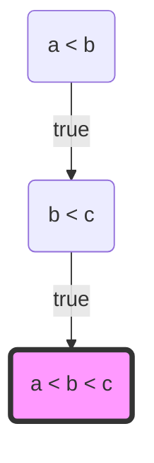
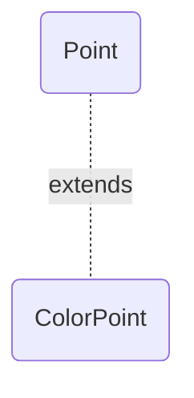

[toc]

# item10. equals는 일반 규약을 지켜 재정의하라


## 언제 `Object.equals()` 를 Override해야할까?

먼저 `Object.equals()`의 동작 과정에 대해서 이해할 필요가 있다.

```java
public boolean equals(Object obj) {
    return (this == obj);
}
```

‼️  `==` 연산자를 이용하여 Instance의 레퍼런스 값을 비교한 결과와 다르지 않다.‼️


`String` 과 같이 하나의 문자열을 표현할 수 있는 인스턴스가 여러 개 존재할 수 있다고 가정해보자. 또한 우리는 해당 인스턴스의 내용(= 문자열의 내용)이 같은지 확인하고자 한다. 이 경우에도 `==` 또는 `Object.equals()`가 유용하게 사용될 수 있을까? $\rightarrow$ **<u>아니다</u>**

이와 같이 인스턴스의 식별자(= 레퍼런스)의 비교가 아닌 인스턴스의 **논리적 비교가 필요할 경우**, `Object.equals()`를 오버라이드할 필요가 있다.

> 동일성(identity): 비교하고자하는 인스턴스가 동일한 인스턴스인지(즉, 해쉬값이 동일한지)
>
> 동등성(equality): 비교하고자하는 인스턴스가 논리적으로 같은지(논리적 동치성)

---

반대로, Override가 필요하지 않는 경우는 아래와 같다.

1. 각 인스턴스가 본질적으로 고유하다.
	* 이 경우에는, 해당 인스턴스의 identity와 equality가 동일한 의미를 가진다.
2. 인스턴스의 `논리적 동치성`을 검사할 일이 없다.
3. 상위 클래스에서 override한 `equals()` 가 하위 클래스에도 딱 들어맞는다.
	* 이 경우, 하위 클래스는 가장 가까운 슈퍼 클래스의 `equals()` 를 호출한다.
4. 클래스가 `private` 이거나 `package-private` 이고 `equals()` 메소드를 호출할 일이 없다.
	* 안전장치로서 `equals()`를 override하여 Exception을 걸어두는 것을 권장한다.


## `equals()` 의 규약

> 일반화된 설명을 위하여 연산자를 # 또는 f(k)로 정의한다.
>
> 각각은 이항, 단항 연산자를 의미한다.

* 반사성(Reflexivity)

null이 아닌 모든 참조 값 $x$에 대하여, $x \# x = x$ 이다. 

`equals()`의 관점에서 해석한다면, 객체는 자기 스스로와 동일해야한다는 의미이다.


* 대칭성(symmetry)

null이 아닌 모든 참조 값 $x, y$에 대하여 $x \# y = y \# x$ 이다.

`equals()`의 관점에서 해석한다면, $x$.equals($y$) = $y$.equals($x$)를 만족한다는 의미이다.


* 추이성(transitivity)

null이 아닌 모든 참조 값 $x, y, z$ 에 대하여 $(x \# y) \land (y \# z) \rightarrow (x \# z)$ 이다.

`equals()`의 관점에서 해석한다면, $x$.equals($y$) 이고 $y$.equals($z$)라면 $x$.equals($z$)도 만족한다는 의미이다.


* 일관성(consistency)

$f(k) = \alpha$ 라면 항상 $k$라는 값을 $f$ 에 대입했을 때, $\alpha$ 라는 값을 보장해야한다.

즉, 결정론적이여야한다. (항상 in-memory 자원에 대한 연산을 수행해야한다)

ex) `Math.random()` 과 같은 비결정론적인 자원이 $f$ 에 포함될 경우, 그 결과도 비결정론적이다.


* not-null

null이 아닌 모든 참조 값 $x$에 대해  $x$.equals(`null`) 은 항상 false이다.


---

### 추이성(Transitivity)을 만족하지 않는다면?

Object.equals()는 여러 컬렉션 클래스들에서 내부적으로 활용되는 메소드이기 때문에, Object.equals()를 Override할 경우 필수적으로 위의 5가지 property를 만족시켜야한다. 그렇지 않을 경우, 예상치 못한 결과를 얻을 수 있다.

직관적인 이해를 위한 예시로, 서로 다른 $x, y, z$의 정렬을 위한 Decision tree를 구성해보았다. (핵심을 위해, 일부분만 구성하였다)




현재 분홍색으로 색칠한 노드를 살펴보자.

해당 노드에 도달하기 위해서 $(a < b) \land (b < c)$ 를  만족한 상태이다. 

해당 노드에서 $b < c$ 라는 조건을 만족할 경우 $a < b < c$ 라는 결과를 얻을 수 있는데, 이것은 앞선 조건에서 `추이성`이 보장되기 때문이다. 만약, 이것이 보장되지 않는다면 실제 $a > c$ 임에도 불구하고 $a < b < c$ 라는 의도치 않은 결과를 얻을 수 있다.

이와 마찬가지로, `equals()` 또한 위 5가지의 규약을 지키지 않는다면 **의도치 않은 결과**를 얻을 수 있다.

(모든 Collection Class 내부의 equals()는 위 5가지 규약을 지킨다는 가정 아래에 동작하기 때문)

---

### 대칭성(Symmetry)을 만족하지 않는다면?

* ex1) 연산의 결과가 대칭성을 갖지 않는 경우 

```java
// 대소문자를 구분하지 않는 문자열을 가지는 클래스
public final class CaseInsentiveString {
    private final String str;
    public CaseInsentiveString(String s) {
        str = Objects.requireNonNull(s); // non-null 조건 만족
    }
    
    @Override
    public boolean equals(Object obj) {
        if (obj instanceof CaseInsentiveString) 
            return str.equalsIgnoreCase((CaseInsentiveString) obj);
       
        if (obj instanceof String)
            return str.equalsIgnoreCase((String) obj);
    }
    @Override public String toString(){return str;}
}

// Belows are Driver Program
CaseInsentiveString cis = new CaseInsentiveString("JooN");
String s = "joon";
/*  test  */
cis.equals(s); // true
s.equals(cis); // false 
```

이를 해결하기 위해서 `CaseInsentiveString` 과 `String` 사이의 Adapter를 도입하여 정규형으로 변환하여 비교하는 로직을 설계하는 것이 적절해보인다. 

---

* ex2) 연산의 결과가 대칭성을 갖지 않는 경우

[diagram]




```java
public class Point {
    private final int x;
    private final int y;
    public Point(int x, int y) {this.x = x; this.y = y;}
    
    @Override public boolean equals(Object obj) {
        if (!(obj instanceof Point))
            return false;
        Point p = (Point) obj;
        return p.x == x && p.y == y;
    }
}
public class ColorPoint extends Point {
    private final char color;
    public ColorPoint(int x, int y, char color) {super(x,y); this.color = color;}
    
    @Override public boolean equals(Object obj) {
        if (!(obj instanceof ColorPoint))
            return false;
        return super.equals(obj) && ((ColorPoint) o).color == color;
    }
}

// Belows are Driver Program
Point p = new Point(1, 2);
ColorPoint cp = new ColorPoint(1, 2, 'R');
/*  test  */
p.equals(cp); // true
cp.equals(p); // false (Point는 ColorPoint의 instance가 아니다)
```

그렇다면, 단순하게 ColorPoint가 Point와 비교를 할 때는 Color필드를 무시하는 방식으로 `equals()`를 정의한다면 해결될까? 

```java
ColorPoint cp1 = new ColorPoint(1, 2, 'R');
ColorPoint cp2 = new ColorPoint(1, 2, 'G');
Point p = new Point(1, 2);
/* test */
cp1.equals(p); // true
p.equals(cp2); // true
//// transitivity X ////
cp1.equals(cp2); // false;
```

위와 같이 여전히 `추이성`문제를 안게된다.

---

### 일관성(Consistency)을 만족하지 않는다면?

일관성을 만족하지 않는다는 것은, $f$ 라는 연산에 대하여 <u>동일한 입력값</u> $k$ 에 대한 연산이 가변적이라는 뜻이 된다.

`a.equals(b)`  의 결과가 a 또는 b의 내용이 변하지 않음에도 불구하고 어느 시점에는 true, 다른 시점에는 false라는 값을 반환하게 된다면 해당 연산에 의존적인 다른 객체들은 예기치 않게 동작할 수 있다.

일관성을 유지하기 위해서 $f$는 결정론적인 연산을 수행해야한다. 이를 위하여 $f$의 내부 연산은 항상 **결정론적인 자원**에 의존해야한다. 또한 해당 자원은 **신뢰할 수 있는 자원**이어야한다.

일관성을 해치는 이유는 아래와 같다.

1. Mutual Exclusion이 보장되지 않는 공유 자원을 이용한 연산
2. 연산에 포함되는 비결정론적인 변인들
3. 연산의 피연산자의 다형성 (ex. a는 어느 시점에는 c가 될 수도 있다.)


---

## `equals()` 확장하기

모든 객체 지향 언어의 동치관계에서 나타나는 문제점으로, **구체 클래스를 확장해 새로운 값을 추가하면서 `equals 규약`을 만족시킬 방법은 존재하지 않는다.**  (객체 지향적 추상화를 포기하지 않고서는..)

> 슈퍼 클래스 A를 상속받은 B 클래스에 대해서 생각해보자.
>
> A $\subset$ B 인것은 자명하다. 그렇다고 항상 B $\subset$ A인 것을 보장할 수 있는가? (대칭성)

Q. 그렇다면, 구체 클래스와 동일한 클래스의 인스턴스만 `equals()` 의 대상으로 삼으면 되지 않을까?

```java
@Override public boolean equals(Object o) {
    if (o == null || o.getClass() != this.getClass())
        return false; // 다른 타입은 항상 false
    Point p = (Point) o;
    return p.x == x && p.y = y;
}
```


A. 객체 지향 원칙(SOLID) 중 하나인 Liscov substitution principle을 만족하지 못한다.

> 리스코프 치환 원칙(Liscov substitution principle)
>
> 부모 객체와 이를 상속하는 자식 객체가 있을 때, 부모 객체를 호출하는 과정에서 자식 객체가 부모 객체를 완전 대체할 수 있어야한다.

**위 예시에서는 Point의 하위 클래스에서 Point를 이용한 활용이 불가능하다.**


Effective Java에서는 **"상속 대신 컴포지션"**을 사용하여 `equals() 와 대응하는 우회법을 추천하고 있다.

즉, 멤버의 관계를 상속(*is -a*) 대신 컴포지션(*has-a*) 관계로 표현한다면 하위 클래스마다 `equals()`를 재정의하는 것이 아닌 View Method를 통해 변환된 객체를 이용한 비교를 통해 객체지향적 이점을 살릴 수 있다.  그 과정은 아래와 같다.

1. Super class의 멤버를 private 필드로 정의한다.
2. Super Class와의 비교가 필요할 경우, Adapter 역할을 하는 별도의 뷰 메소드를 추가한다.
	* `equals()`는 동일 클래스의 비교에 대해서만 그 역할을 수행하고, 타입이 다른 경우 그에 대응하는 뷰 메소드를 호출하여 `equals()`에 객체를 넘겨준다.
3. `equals()` 의 parameter로 들어오는 객체와 자기 자신의 핵심 필드들이 모두 일치하는지 확인한다.

```java
public class ColorPoint {
    private final Point point;
    private final char color;
    
    public ColorPoint(int x, int y, char color) {
     	point = new Point(x, y);
        this.color = color;
    }
    
    // View Method
    public Point asPoint() {
        return point;
    }
    
    @Override public boolean equals(Object o) {
        if (!(o instanceof ColorPoint))
            return false;
        ColorPoint cp = (ColorPoint) o;
        return cp.asPoint().equals(point) && cp.color.equals(color);
    }
}
// Belows are Driver Program
ColorPoint a = new ColorPoint(1, 2, 'R');
Point b = new Point(1, 2);
ColorPoint c = new ColorPoint(1, 2, 'G');
// test
a.equals(b.asColorPoint()); // true 라 가정
b.equals(a.asPoint()); // true

```

---

## `equals()`를 잘 정의하는 방법

1. **`==`연산자를 사용해 입력이 자기 자신의 참조인지 확인한다. (identity 확인)**

	동등성은 동일성의 부분집합이므로 동일성이 만족되는 경우, 항상 동등성이 보장된다.

	단순 레퍼런스 비교이므로, 비교 연산의 오버헤드가 클 경우 효과적일 수 있다.

2. **`instanceof` 연산자를 사용해 입력이 올바른 타입인지 확인한다.**

	서로 다른 클래스의 인스턴스간의 비교는 공통 조상의 `equals()`로 비교를 수행한다. (또는 Adapter 패턴 이용)

	그렇지 않을 경우, `대칭성`을 보장할 수 없으므로 false를 반환한다.

3. **입력을 올바른 타입으로 형 변환한다.**

	`instanceof` 검사를 마친 이후이기 때문에 `Object` 를 적절한 타입으로 형 변환할 수 있다. 

	구체 클래스의 필드의 검사를 위하여 형 변환하는 과정은 필수적이다.

4. **입력 객체와 자기 자신의 대응되는 '핵심'필드들이 모두 일치하는지 하나씩 검사한다.**

	모든 필드가 일치하면 true, 하나라도 다르다면 false를 반환한다. (and 조건)

	이 때, 대부분의 컴파일러는 수식을 최적화하여 검사하므로 연산의 cost가 비교적 작은 필드부터 검사하는 것이 좋다.

	```
	ex) f(a) && f(b) && f(c)
	f(a) 부터 f(c)까지 검사하면서 false가 나오는 순간 뒤에 존재하는 수식에 대한 평가를 하지 않는다.
	```


* 항상 위 과정을 모두 마친 뒤에는 `equals()`의 5가지 규칙을 만족하는지 확인해야한다. 

* equals()를 재정의할 때는 hashCode도 반드시 재정의하자. (hashCode연산은 `equals()`에 의존적이다.)
* Object  class의 `equals()` 를 Override하기 위해 메소드의 원형은 다음과 같아야한다.

```java
@Override public boolean equals(Object o) {...}
```

