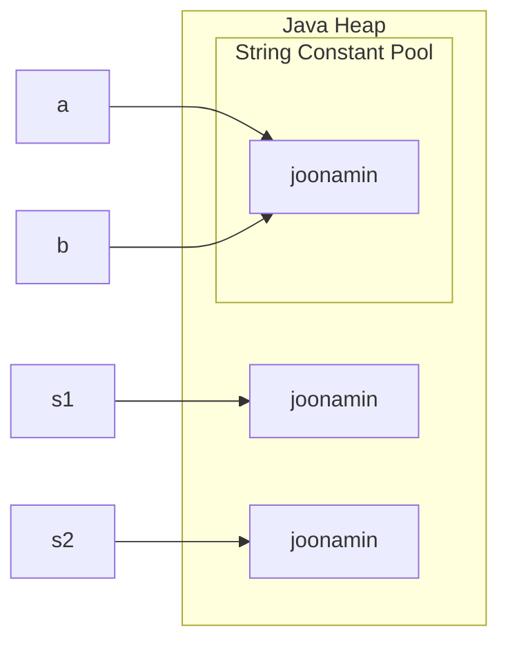
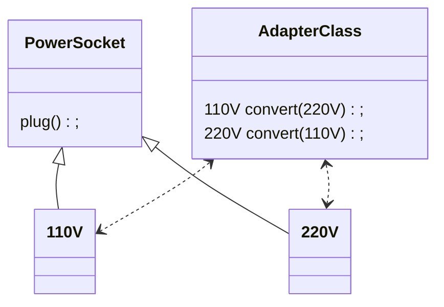

[toc]

# item6. 불필요한 객체 생성을 피하라

## 객체를 생성하는 것보다 기존의 객체를 재사용하는 것이 성능면에서 좋다

**일반적으로 객체의 생성 비용은 생성된 객체를 Retrieve하는 것보다 더 느리다.**

* 일반적인 객체 생성 과정

	1. 메모리 영역에 객체 할당에 필요한 공간을 확보 (kernel)
		* 할당받은 새로운 영역에 대한 논리 주소를 페이지 테이블에 추가
	2. 객체를 초기화 (생성자)

	[참고1](https://unix.stackexchange.com/questions/566273/how-does-the-paging-concept-work-with-heap-and-stack-memory) [참고2](https://dzone.com/articles/thread-local-allocation-buffers)

* 일반적인 객체 접근 과정
	1. 논리 주소를 통해 물리 메모리에 적재된 내용을 참조
		* MMU에서 가상주소 $\rightarrow$ 물리주소 매핑

객체 생성에 따른 overhead가 더 크다.

---

### 특히나, 불변(Immutable) 객체에 대해서는 재사용을 권장한다.

* 불변 객체는 `항상 동일한 행위를 수행한다`  라는 특징을 갖기도 한다. 
* 이 경우, 비효율적인 객체 생성은 권장 되지 않는다.

ex) 

```java
/* 불필요한 객체 생성 예시 */
String s1 = new String("joonamin"); // 1. "joonamin" 이라는 정보를 가진 String 객체 생성
String s2 = new String("joonamin"); // 2. "joonamin" 이라는 정보를 가진 String 객체 생성
String a = "joonamin"; // 3. "joonamin" 이라는 String literal에 대한 레퍼런스 저장
String b = "joonamin";	//  4. "joonamin" 이라는 String literal에 대한 레퍼런스 저장
```

위 코드는 아래와 같이 레퍼런스가 매핑된다.



s1 과 s2 를 살펴보면 동일한 내용의 문자열을 표현하기 위해서 서로 다른 2개의 객체가 생성되었음을 확인할 수 있다.

+ 위 예시에서는, 엄청난 성능 차이를 보이긴 어려우나 객체의 크기가 크면 클 수록 객체 생성에 따른 Overhead가 크므로 성능에 치명적인 영향을 줄 수 있다.

---

### 불변 객체가 아니더라도 객체를 재사용하는 것이 유용한 경우가 있다.

* 객체가 하는 역할이 고정적이라면 (즉, 불변 객체라면) 객체를 재사용해도 **안전하게** 값을 참조할 수 있다. 

* 반대로, 가변 객체라면 객체의 값을 참조하는 시점에 따라 얻을 수 있는 결과가 비결정론적이다. (동기화)


**가변 객체의 Mutual Exclusion이 보장되고, 객체 재생성에 따른 Overhead가 클 경우 재사용이 권장된다.**

* ex) DB connection Pool

> 암달의 법칙

**가변 객체일지라도, 역할이 제한적이면 객체를 재사용하는 것이 유용할 수 있다.**

* ex) Adapter class




AdapterClass의 인스턴스는 110V 와 220V를 상호변환하는 역할을 수행한다. 

<u>AdapterClass의 객체의 레퍼런스 변수가 가변적이어도, 항상 양 끝단의 `변환` 기능을 수행한다는 사실은 변하지 않는다.</u>

이럴 경우는, 레퍼런스 값이 변한다고 해서 인스턴스를 재생성 할 필요가 없이 적절하게 내부 멤버만 수정해주기만 한다면 객체를 재생성하는 것보다 **성능면에서 이점**이 있음을 확인할 수 있다.

---

### 의도치 않은 오토 박싱을 주의하자

* 자바는 내부적으로 primitive type 과 대응하는 Wrapper Class를 제공한다. 

* primitive type과 그와 대응하는 Wrapper Class간의 대입 연산(=)이 이루어질 경우 내부적으로 값을 박싱 또는 언박싱한다. 

오토 박싱은 사용자가 Primitive type과 Wrapper Class type을 혼용하여 사용할 수 있도록 편의성을 제공하지만 성능면에서는 독이 될 수 있다.


ex)

```java
// 극단적인 성능 저하 예시 
// 수행 시간: 6.3s
private static long sum() {
    Long sum = 0L;
    for (long i = 0; i <= Integer.MAX_VALUE; i++) {
        sum += i; // long -> Long
    }
    return sum;
}
```

primitive type인 `long` 과 Wrapper class인 `Long` 간의 박싱 과정이 5번째 줄에서 수행되는 것을 확인할 수 있다.

이러한 과정이 `Integer.MAX_VALUE` 만큼 반복된다면, 그 횟수만큼 `Long` 인스턴스가 생성된다.

이 후, `Long` 타입인 `sum` 이 리턴 타입인  `long` 타입으로 언박싱된다. 


```java
// 오토 박싱이 이루어 지지 않음
// 수행 시간: 0.59s 
private static long sum() {
    long sum = 0L;
    for (long i = 0; i <= Integer.MAX_VALUE; i++) {
        sum += i; // long -> long
    }
    return sum;
}
```

성능 차이는 명확하다는 것을 확인해볼 수 있다.

---

### 객체 생성은 무조건 좋지 않는가?

==**아니다!**== 

* 객체는 프로그램을 더욱 더 **간결하게**, **명확하게**, **가독성있게** 만들어준다.
* 자바의 gc는 최적화가 잘 되어있기 때문에, <u>가벼운 객체</u>를 다룰 때는 객체를 재활용하기 위한 pool을 구성하기보다 객체를 재생성하는 것이 더 효율적일 수 있다.
* 객체를 재사용한다는 것은 보안적 측면에서 좋지 않을 수 있다.
	* 일반적으로, 성능을 위해서 객체 사용 이후 해당 객체가 존재하는 메모리 영역의 데이터를 삭제하지 않고 단순하게 `사용가능` 상태로 만든다.
	* 이 경우, 객체 재사용시 이전 객체의 값의 일부분을 획득할 수 있다. (`memory exposure`)
	* 방어적 프로그래밍 관점에서, 시스템에 Critical한 영향을 주는 변수가 검사 시점/사용 시점에 따라 값이 다를 수 있고 이 경우 시스템에 치명적인 결과를 초래할 수 있다. (`TOCTOU 공격`)


<u>**결론: 객체 재활용과 재생성 각각에 대한 장/단점을 고려하여 프로그램을 설계하자**</u>

